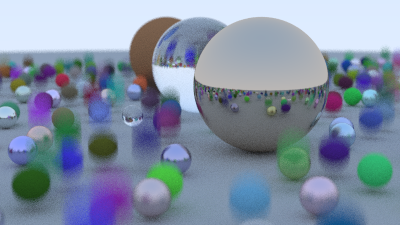
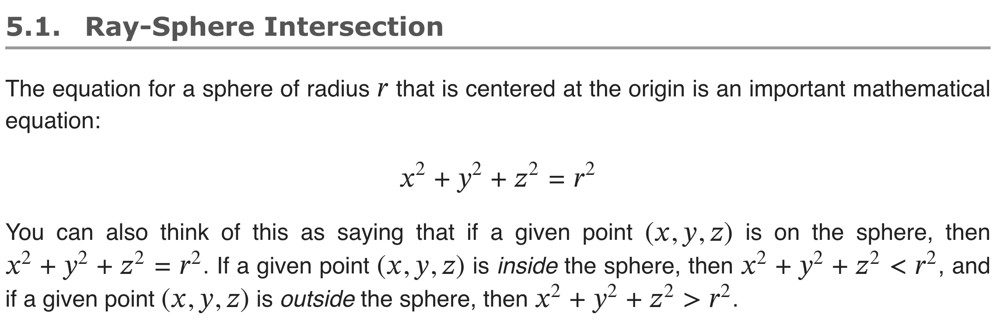

# Raytracer

UPDATE: Turns out, there's a whole series... https://raytracing.github.io/ !

I will be following the rest of the books as well.

Up next: "3. Bounding Volume Hierarchies"

Current rendition: 

## Requirements

* Image magick for converting ppm to png

## Notes

## Links

* [PPM to PNG converter with C++](https://www.reddit.com/r/cpp/comments/rdgvmv/a_basic_ppm_p3_to_png_converter_with_c_modules/)
  * https://github.com/pjmlp/ppm2png - not directly applicable, but could be translated
